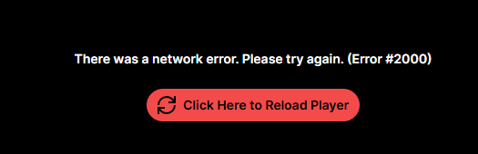

# Tired of constant popups in the Twitch player?

  
    
  
  
    
  

Install custom userscripts to automatically remove annoying overlays and playback errors.

### Supported Twitch Interface Languages

- English (EN)  
- Russian (RU)  

Other languages are currently not supported.

---

## Included Userscripts

### 1. Twitch Auto Reload Player
Automatically clicks the **Reload Player (перезагрузить проигрыватель)** button whenever Twitch shows common playback errors such as:

- Error #1000  
- Error #2000  
- "There was a network error" 

### 2. Twitch Auto Close AdBlock Popup
Automatically closes the Twitch AdBlock warning popup, including:

- "Support channel by disabling ad block"
- "Поддержите канал, отключив AdBlock"

Closes it using the appropriate button depending on interface language.

---

# Installation

## 1. Install the Tampermonkey extension
Chrome / Edge: https://www.tampermonkey.net/?ext=dhdg&browser=chrome  
Firefox: https://www.tampermonkey.net/?ext=dhdg&browser=firefox  

## 2. Open the userscript you want to install
Direct links:

- Auto Reload Player:  
  https://raw.githubusercontent.com/lllexxa/twitch-userscripts/main/Twitch-Auto-Reload-Player.user.js

- Auto Close AdBlock Popup:  
  https://raw.githubusercontent.com/lllexxa/twitch-userscripts/main/Twitch-Auto-Close-AdBlock-Popup.user.js

## 3. Click “Install” in Tampermonkey  
The script will start working automatically on Twitch.

---

# Notes
After installation, the player will automatically recover from errors, and intrusive popups will be closed without any user interaction.

Feel free to open Issues or submit Pull Requests for improvements.
